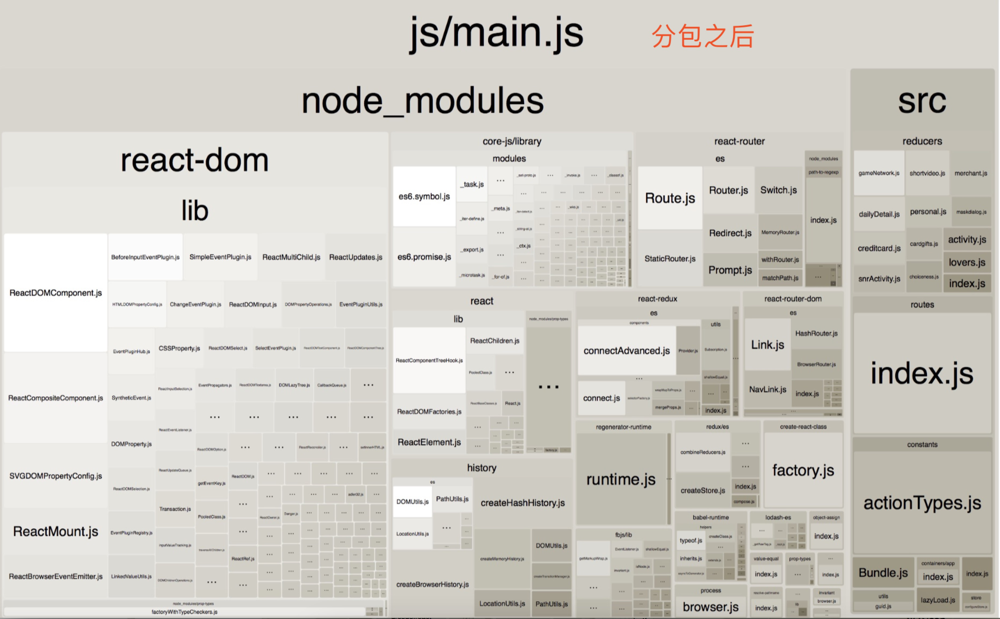

## 常见的性能优化
+ 图片压缩
+ cdn资源
+ 代码压缩
+ 路由懒加载（这次要说的的重点）

## 路由懒加载

### 先说实现方案
+ 依赖的有react-router、webpack、ES6的import()、webpack打包分析插件webpack-bundle-analyzer等
+ 工具函数1
```
import React from 'react';

export default class Bundle extends React.Component {
    state = {
      mod: null
    }
    componentWillMount() {
      console.log("Bundle---,",this.props)
      this.load(this.props);
    }
    componentWillReceiveProps(nextProps) {
      if (nextProps.load !== this.props.load) {
        this.load(nextProps);
      }
    }
    // 更改 load 方法为异步函数
    async load(props) {
      this.setState({
        mod: null
      });
      /*
        使用 props.load() 返回的是一个 promise
        */
      const mod = await props.load();

      this.setState({
        mod: mod.default ? mod.default : mod
      });
    }

    render() {
      return this.state.mod ? this.props.children(this.state.mod) : null;
    }
}

```
+ 工具函数2

```
import React from 'react';
import Bundle from './Bundle';

// 默认加载组件，可以直接返回 null
const Loading = () => <div>Loading...</div>;

/*
    包装方法，第一次调用后会返回一个组件（函数式组件）
    由于要将其作为路由下的组件，所以需要将 props 传入
*/
const lazyLoad = loadComponent => props => (
  <Bundle load={loadComponent}>
    {Comp => (Comp ? <Comp {...props} /> : <Loading />)}
  </Bundle>
);

export default lazyLoad;

```
+ 使用router配置的入口文件

```
import React from 'react'
import { Route } from 'react-router-dom'
import lazyLoad from '../lazyLoad';
<!--静态加载方式-->
// import GameNetwork from '../containers/gameNetwork'
<!--动态加载方式-->
const GameNetwork = lazyLoad(() => import('../containers/gameNetwork'));
<!--N多其他路由定义-->

export default class Routes extends React.Component {
  render() {
    let routes = (
        <div className="view">
            <!--N多其他路由配置-->
            <Route path="/gameNetwork.html" component={GameNetwork}/>
        </div>
    )
    return routes
  }
}

```

### 优化后的效果





分析原因：原始的打包方式，是将所有的文件都打包到一个js中，然而加载官网的时候，却加载了其他不需要用到的js、所以导致文件很大、加载缓慢

想到的解决办法：code Splitting

那什么是codeSpliting：https://webpack.docschina.org/guides/code-splitting/  代码分割、将各个路由对应的文件拆开，只在react-router匹配到路由的时候，才动态的加载页面信息


动态导入就能实现是什么原理？

import()函数可以用在任何地方，不仅仅是模块，非模块的脚本也可以使用。它是运行时执行，也就是说，什么时候运行到这一句，就会加载指定的模块。

 
import ** from **; 编译时、静态加载

import(**); 运行时、动态加载、异步的  返回一个promise

node 的 require(**) 运行时、动态加载、同步的


【ES6 的模块加载机制】

