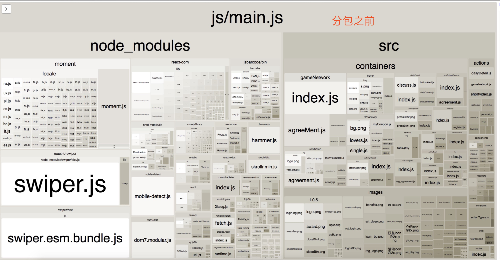

## 常见的性能优化
+ 图片压缩
+ cdn资源
+ 代码压缩
+ 按需加载(这次的重点)

### 先来分析下

1. 慢的原因是什么？

+ webpack打包会将所有代码打包到一个`bundle`，然而随着项目额逐渐扩大，文件数量将急剧增加，不经意间使得打包文件过大而造成应用加载的缓慢。

2. 解决的目标是什么？

+ 能否`按需加载`

3. 采用的办法是什么？

+ `Code Splitting`（提倡的是将代码分块`chunk`，通过定义一些分割点来实现分块，从而实现按需加载。）

### 思考的过程中产生的几点疑问

```
1. 分析产生`慢`的原因
2. 知道为什么`慢`，但是如何解决呢？
3. 知道了解决办法，可是为什么这么做就能实现按需加载呢？
```

带着以上的几点疑问，我想要更深入的了解以下几个点

```
1. ES6的import()函数为什么可以实现`动态导入`？
2. ES6的模块加载机制
```

### 最后附上实现方案

+ 依赖的有react-router、webpack、ES6的import()、webpack打包分析插件webpack-bundle-analyzer等
+ 工具函数1
```
import React from 'react';

export default class Bundle extends React.Component {
    state = {
      mod: null
    }
    componentWillMount() {
      console.log("Bundle---,",this.props)
      this.load(this.props);
    }
    componentWillReceiveProps(nextProps) {
      if (nextProps.load !== this.props.load) {
        this.load(nextProps);
      }
    }
    // 更改 load 方法为异步函数
    async load(props) {
      this.setState({
        mod: null
      });
      /*
        使用 props.load() 返回的是一个 promise
        */
      const mod = await props.load();

      this.setState({
        mod: mod.default ? mod.default : mod
      });
    }

    render() {
      return this.state.mod ? this.props.children(this.state.mod) : null;
    }
}

```
+ 工具函数2

```
import React from 'react';
import Bundle from './Bundle';

// 默认加载组件，可以直接返回 null
const Loading = () => <div>Loading...</div>;

/*
    包装方法，第一次调用后会返回一个组件（函数式组件）
    由于要将其作为路由下的组件，所以需要将 props 传入
*/
const lazyLoad = loadComponent => props => (
  <Bundle load={loadComponent}>
    {Comp => (Comp ? <Comp {...props} /> : <Loading />)}
  </Bundle>
);

export default lazyLoad;

```
+ 使用router配置的入口文件

```
import React from 'react'
import { Route } from 'react-router-dom'
import lazyLoad from '../lazyLoad';
<!--静态加载方式-->
// import GameNetwork from '../containers/gameNetwork'
<!--动态加载方式-->
const GameNetwork = lazyLoad(() => import('../containers/gameNetwork'));
<!--N多其他路由定义-->

export default class Routes extends React.Component {
  render() {
    let routes = (
        <div className="view">
            <!--N多其他路由配置-->
            <Route path="/gameNetwork.html" component={GameNetwork}/>
        </div>
    )
    return routes
  }
}

```

+ webpack配置

```
<!-- 省略了详细配置 -->
module.exports = {
  entry: [
    './src/index.js'
  ],
  output: {
    path: resolve('output'),
    filename: 'js/[name].[chunkhash:5].js' ,
    publicPath: '',
    chunkFilename: 'js/[name].[chunkhash:5].chunk.js'
  },
}

module.exports.plugins.push(
    // webpack打包分析图、需要的时候可以打开注释
    new BundleAnalyzerPlugin({ analyzerPort: 8919 })
)
```


### 优化后的效果

+ 可以看到分包之前，main.js中包含的是所有的js文件、而优化后则只包含了当前路由需要的js文件、达到的效果是：main从原来的`一个1.8M`文件变成了`90多K的main和84k的chunk`




### 参考文件

[webpack代码分离](https://webpack.docschina.org/guides/code-splitting/)
[react code-splitting](https://www.reactjscn.com/docs/code-splitting.html)
